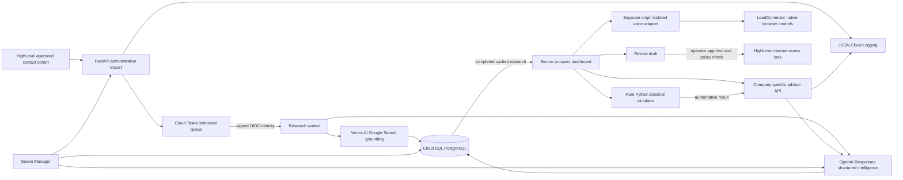

# Architecture and request processing

This diagram describes the implemented interfaces and intended cloud topology. Local development uses SQLite. The diagram is not evidence of deployment.

## Synchronous dashboard path

The dashboard reads completed research and intelligence from SQL. It makes no research/model call during initial load. A CRM import first stores minimal company/first-name context as `pending`; research must succeed and intelligence must contain supported content before a private link is issued. Imported completed research uses the same intelligence/access boundary.

Private links carry a cryptographically random token in a URL fragment. SQL stores only its SHA-256 digest. A POST exchange issues a fresh random HTTP-only `SameSite=Strict` cookie. Every private session rechecks link expiry/revocation. Mutation requests require a CSRF header and reject unexpected browser Origins. No CORS access is granted. Link tokens are excluded from request routes/logs and removed from browser history after exchange. The link is a bearer capability; do not distribute it publicly.

## Advisor and numerical authority

The official OpenAI SDK calls `responses.parse(..., text_format=AdvisorAnswer, store=False)`. Pydantic controls response shape; it does not establish truth. The application validates observations against **complete** stored excerpts, rejects invented sources and replaces free-form model recommendation prose with a reviewed catalogue. The model chooses relevant solution/evidence combinations; the server labels these hypotheses. Unsupported/refused/incomplete answers remain explicit, and incomplete intelligence does not mint access.

This is an intentionally conservative extractive MVP. It sacrifices unrestricted prose for a demonstrable trust boundary. Stored provider-grounded excerpts may still be inaccurate: Google grounding is not independent fact checking. Recommendations may be poorly matched to a source and require owner validation. Synthetic fixture sources are clearly labeled and are never used as evidence for a real imported prospect.

`calculate()` is a pure Decimal function. It derives missed leads, recovery, appointments, expected customers, revenue/net/ROI/break-even from bounded user inputs. It uses full precision through the conversion chain and rounds outputs at the end. Fractional customers are expected values, not promised bookings. Zero denominators return `null`. Positive currency assumptions below one cent are rejected. Model text cannot populate or override simulator result fields. The API appends a deterministic numerical explanation to the advisor answer.

## Background research and durability

Cloud Tasks sends only an internal prospect ID to the research endpoint with a signed OIDC token. Queue and worker use the canonical service origin as audience. The application checks verified Google identity/email; a private worker additionally uses Cloud Run invoker IAM. A compare-and-set transition and ten-minute lease prevent concurrent duplicate research. Completed retries read the cache; expired research leases allow a retry after process failure. A task-creation race cannot regress `researching`/`complete` to `queued`.

The queue should retry 409/5xx with backoff. A failure leaves `failed`, prevents new access, and records no unverified success. Cloud task enqueue is an operator-gated write, disabled by default. The SQL state/queue call are not a transactional outbox: a rare crash between provider creation and DB commit requires reconciliation. Cloud Tasks is at-least-once, so provider costs may still repeat after a crash following a completed provider response but before commit.

Vertex stores only metadata-supported text segments with HTTPS source IDs, timestamps and required Google Search attribution. These excerpts are grounded model segments, not verbatim website scrapes. Attribution is served in a sandboxed iframe with scripts denied, keeping provider HTML out of the parent document.

Cloud SQL uses its official Python connector/pg8000 with password supplied by Secret Manager. Cloud Run startup rejects SQLite. Schema creation uses SQLAlchemy metadata for this fresh MVP; introduce versioned migrations before changing a deployed database. The connection pool and connector close at shutdown. Use encrypted managed PostgreSQL and backup/retention policy before accepting customer data.

## Voice and follow-up isolation

Production voice agents have CRM summaries/notifications, actions, workflows or real calendars. Their audited widget IDs are denied even if an isolation flag is set. The public dashboard currently plays a recorded demonstration and shows scenarios; scenario selection does not alter that recording.

The optional `app.voice` service must run on a different origin from the dashboard. It contains no database, secret access or CRM/private APIs. It loads the public native LeadConnector controls only after an explicit click, using a dedicated audited demo widget. Separate origin prevents provider JavaScript from reading the personalized dashboard session. Its audio lifecycle and side effects remain unverified until an isolated provider is authorized and tested.

A visitor request writes a SQL **draft** only. HighLevel delivery requires an administrative key, explicit `approved=true`, an enabled delivery configuration, a nonsynthetic linked contact, the approved cohort tag, and a fresh suppression check. It creates only an internal review task, with exact readback. Unknown delivery outcomes become `delivery_unknown`; they are never automatically retried. No outreach or workflow enrollment endpoint exists.

## Observability and cost controls

Every API request records a server-generated request ID, route template, status and duration. The provider records model, input/cached/output tokens, estimated cost/reference and status. Prompts, research payloads, contact IDs, email/phone, cookies and credentials are not logged. Cloud Run collects JSON stdout after deployment; only existing-service ingestion was audited.

Engineering View reads only the current session's traces/usage. It shows live local events and explicit configured/unverified service state. It does not expose global traffic, credentials or other prospects.

Before OpenAI calls, SQL reserves an attempt against per-session and shared hourly budgets. SQLite uses a write lock locally; PostgreSQL uses an advisory transaction lock across replicas. Provider failures still count against attempt budgets. Maximum input/message/context and output token bounds constrain request size. Attempt budgets are not dollar budgets; add model-specific monetary budgets/rate protection for a public scaled deployment.

Chat bodies are intentionally retained for session history in SQL and can contain user-entered sensitive data. Session expiry prevents reads but is not physical deletion. Before real production traffic, define/enforce retention deletion, database access/IAM, consent, backups, quota/rate policy and managed schema migration. These are release work, not current operational claims.
